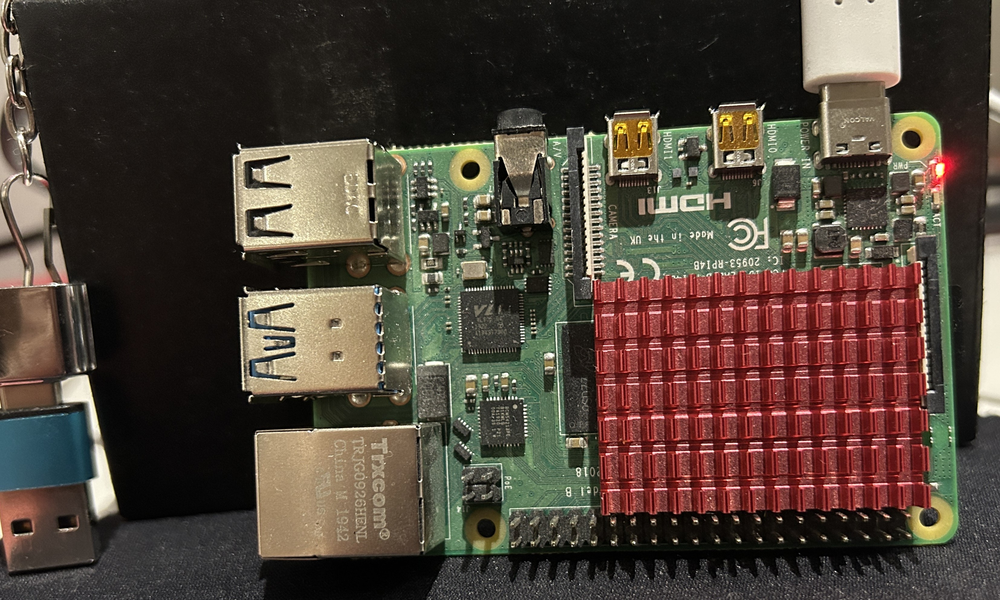

# pifrr
FRRouting on Raspberry Pi 4B using Containerlab


#### Deploy


```                                                           
  +-----+    12.0.0.0/24     +-----+   23.0.0.0/24     +-----+
  | R1  ---------------------| R2  |-------------------| R3  |
  +-----+                    +-----+                   +-----+
```


```
$ sudo clab deploy -t pifrr.yml
INFO[0000] Containerlab v0.56.0 started
INFO[0000] Parsing & checking topology file: pifrr.yml
INFO[0000] Creating docker network: Name="clab", IPv4Subnet="172.20.20.0/24", IPv6Subnet="2001:172:20:20::/64", MTU=1500
WARN[0000] Unable to load kernel module "ip6_tables" automatically "load ip6_tables failed: exec format error"
INFO[0000] Creating lab directory: /home/admin/github/pifrr/clab-pifrr
INFO[0000] Creating container: "R3"
INFO[0000] Creating container: "R2"
INFO[0000] Creating container: "R1"
INFO[0001] Created link: R1:eth1 <--> R2:eth1
INFO[0001] Created link: R2:eth2 <--> R3:eth2
INFO[0001] Adding containerlab host entries to /etc/hosts file
INFO[0001] Adding ssh config for containerlab nodes
+---+------+--------------+------------------------------+-------+---------+----------------+----------------------+
| # | Name | Container ID |            Image             | Kind  |  State  |  IPv4 Address  |     IPv6 Address     |
+---+------+--------------+------------------------------+-------+---------+----------------+----------------------+
| 1 | R1   | 60ba62e38a5e | quay.io/frrouting/frr:10.1.0 | linux | running | 172.20.20.4/24 | 2001:172:20:20::4/64 |
| 2 | R2   | ef5d92f11261 | quay.io/frrouting/frr:10.1.0 | linux | running | 172.20.20.2/24 | 2001:172:20:20::2/64 |
| 3 | R3   | 5a6bc2024db0 | quay.io/frrouting/frr:10.1.0 | linux | running | 172.20.20.3/24 | 2001:172:20:20::3/64 |
+---+------+--------------+------------------------------+-------+---------+----------------+----------------------+
```

#### Test

```
$ sudo docker exec -it R1 ping -c1 23.0.0.3 -I eth1
PING 23.0.0.3 (23.0.0.3): 56 data bytes
64 bytes from 23.0.0.3: seq=0 ttl=63 time=0.217 ms

--- 23.0.0.3 ping statistics ---
1 packets transmitted, 1 packets received, 0% packet loss
round-trip min/avg/max = 0.217/0.217/0.217 ms
```

```
 $ sudo docker exec -it R1 traceroute -n 23.0.0.3
traceroute to 23.0.0.3 (23.0.0.3), 30 hops max, 46 byte packets
 1  12.0.0.2  0.017 ms  0.024 ms  0.019 ms
 2  23.0.0.3  0.013 ms  0.021 ms  0.018 ms
```
